# Microsoft Entra ID IAM Troubleshooting Lab

## Project Overview

This project is a collection of hands-on IAM troubleshooting tickets I worked through in Microsoft Entra ID.

Instead of only creating users and groups, I focused on figuring out what was wrong, checking the account and logs, making the right change, and then verifying that the issue was fixed.

The tickets cover user access changes, excessive admin permissions, failed sign-ins, and MFA problems.

## Technologies Used

- Microsoft Entra ID
- Microsoft Entra Admin Center
- Microsoft Authenticator
- Role-Based Access Control (RBAC)
- Entra Sign-In Logs
- MFA Number Matching
- Group-Based Access Management

---

# Ticket 1: Mover / Privilege Creep

## Scenario

Kevin Durant moved from Finance to HR, but his account still had access from his old Finance role.

## What I Found

Kevin was still a member of:

- `SG-FIN-Employees`
- `SG-FIN-AP-Users`

Since he no longer worked in Finance, those groups gave him access he no longer needed.

This is an example of **privilege creep**, where old access stays on an account after someone changes roles.

## What I Changed

I first added Kevin to:

- `SG-HR-Employees`

I added the new HR access before removing the Finance access so he would not lose the access he actually needed during the move.

After confirming the HR group was added, I removed:

- `SG-FIN-Employees`
- `SG-FIN-AP-Users`

## How I Verified It

I checked Kevin's group memberships again and confirmed that only the HR group remained.

## Walkthrough

### 1. Old Finance Access Was Still Assigned

Kevin still had two Finance-related groups even though he had moved to HR.

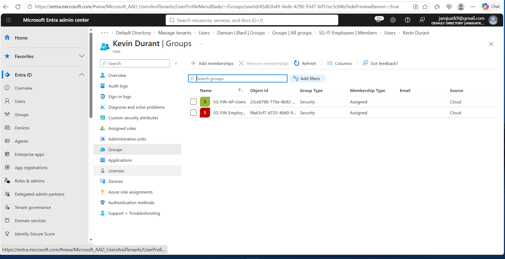

### 2. Added the New HR Access

I added `SG-HR-Employees` before removing the old Finance groups.

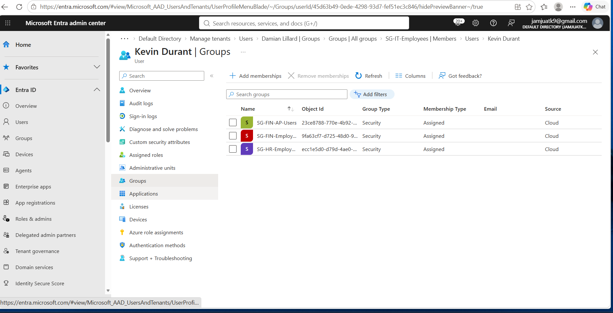

### 3. Removed the Old Finance Access

After the old Finance groups were removed, Kevin was left with only the access needed for his HR role.

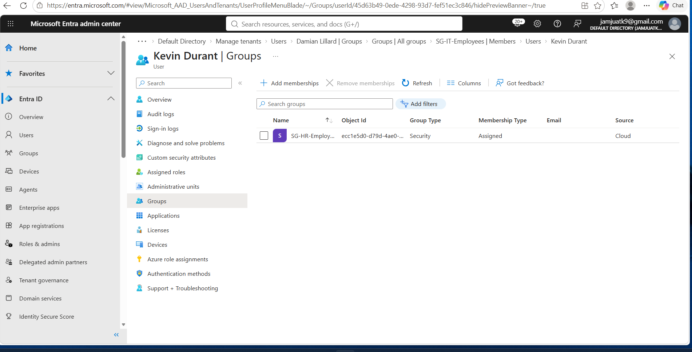

## Result

Kevin had moved from Finance to HR, so I gave him the HR access he needed, removed the Finance access he no longer needed, and checked his account afterward to make sure only the correct access remained.

## What I Learned

- Joiner-Mover-Leaver (JML)
- Privilege creep
- Least privilege
- RBAC
- Group-based access control
- Access validation

---

# Ticket 2: Administrative Role Right-Sizing

## Scenario

Stephen Curry's admin account had more administrative access than his job actually required.

## What I Found

The account had the **User Administrator** role.

That role gave the account broader user-management permissions than were needed for password resets and basic help desk work.

## What I Changed

I removed the **User Administrator** role.

Then I assigned **Helpdesk Administrator** instead.

This allowed the account to keep the support permissions it needed without keeping unnecessary admin access.

## How I Verified It

I checked the account again and confirmed that **Helpdesk Administrator** was assigned.

## Walkthrough

### 1. User Administrator Was Assigned

The account originally had the broader User Administrator role.

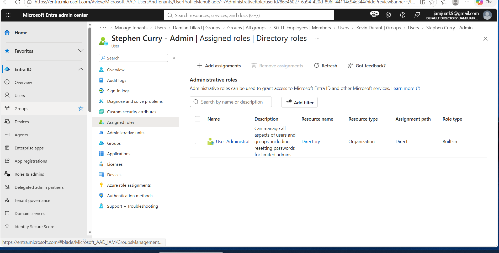

### 2. Removed the Broader Role

I removed User Administrator before assigning the replacement role.

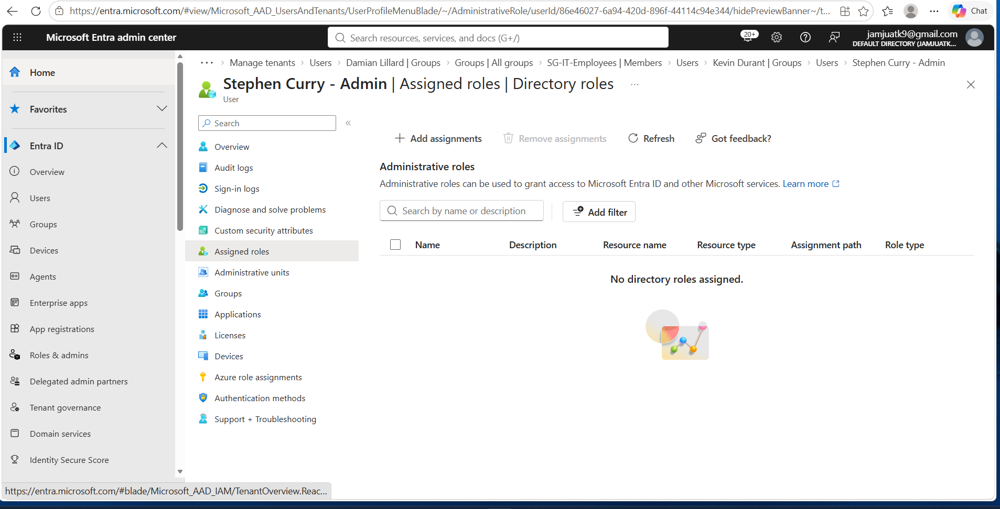

### 3. Assigned Helpdesk Administrator

I assigned Helpdesk Administrator because it better matched the account's job responsibilities.

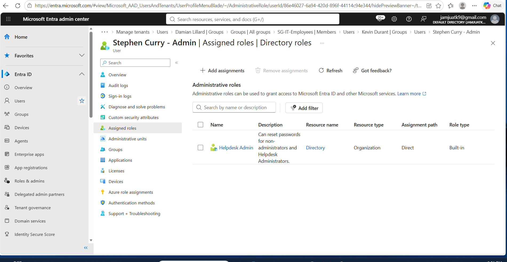

## Result

I reduced the account's admin access while still keeping the permissions needed for password resets and user support.

## What I Learned

- Least privilege
- Administrative role management
- Role right-sizing
- Delegated administration
- Access review

---

# Ticket 3: Sign-In Failure Investigation

## Scenario

Chris Bosh reported that he could not sign in.

## What I Found

I first confirmed that his account was enabled.

Then I checked his Microsoft Entra sign-in logs.

The failed sign-in showed:

- **Status:** Failure
- **Error code:** 50126
- **Failure reason:** Invalid username or password

This showed that the problem was with the credentials, not because the account was disabled.

I also checked the Conditional Access information and did not find a policy causing the failure.

## What I Changed

I reset Chris's password and had him sign in again.

After the password reset, he was able to successfully access his account.

## How I Verified It

I went back to the Entra sign-in logs and confirmed a new sign-in with:

- **Status:** Success
- **Error code:** 0

## Walkthrough

### 1. User Saw a Password Error

This is the error Chris saw when trying to sign in.

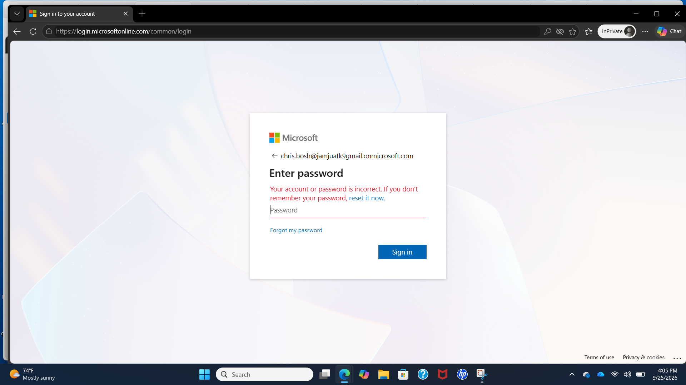

### 2. Checked the Sign-In Logs

The Entra sign-in logs showed error **50126**, which pointed to invalid credentials.

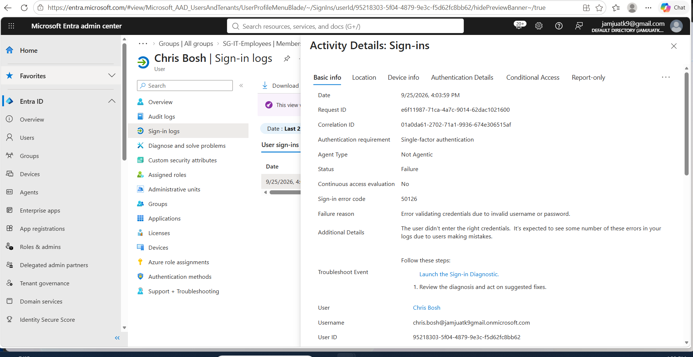

### 3. Reset the Password

After finding the cause, I reset the user's password.

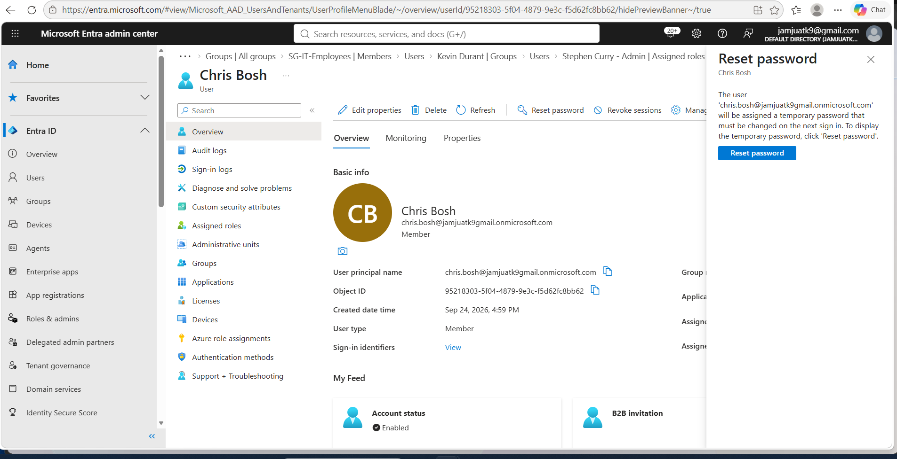

### 4. Verified the Fix

The new sign-in showed **Success**, confirming the account was working again.

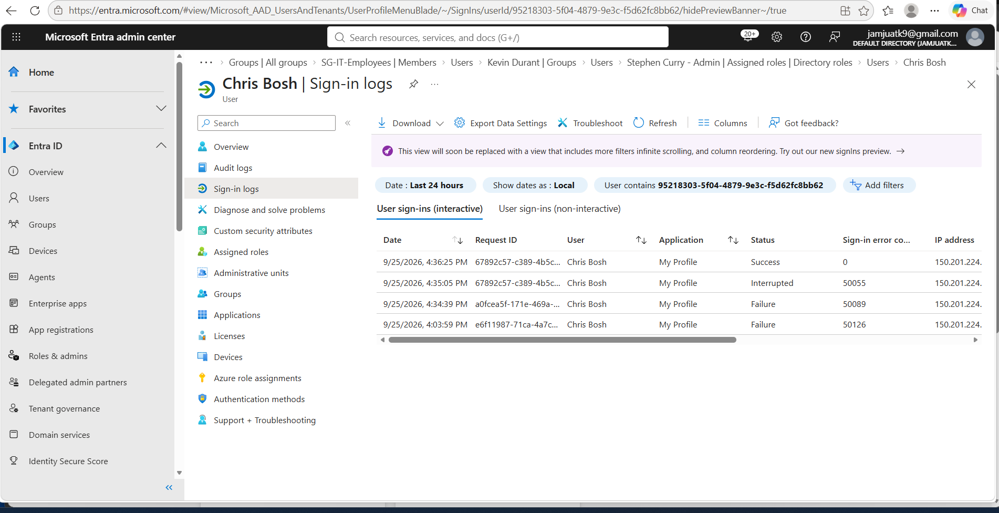

## Result

I used the Entra sign-in logs to find the cause of the login problem, reset the password, and confirmed through the logs that the user could successfully sign in again.

## What I Learned

- Authentication troubleshooting
- Sign-in log analysis
- Error-code investigation
- Password resets
- Root-cause analysis
- Post-fix verification

---

# Ticket 4: MFA Registration and Recovery

## Scenario

James Harden could not complete MFA because his account did not have a usable authentication method registered.

## What I Found

When I checked his Authentication Methods page, it showed:

- No default sign-in method
- No usable authentication methods
- No system-preferred MFA method

That meant he had no method available to complete an MFA challenge.

## What I Changed

I required James to re-register MFA.

Then I signed in as James and set up Microsoft Authenticator.

During setup, I tested Microsoft Authenticator number matching to make sure MFA was working.

## How I Verified It

I returned to James's Authentication Methods page and confirmed that:

- Microsoft Authenticator was registered
- Microsoft Authenticator notification was the default method
- A usable MFA method was now available

## Walkthrough

### 1. No Usable Authentication Method

James originally had no usable MFA method registered.

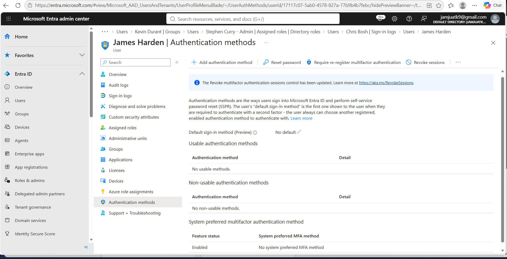

### 2. Required MFA Re-Registration

I required the user to go through MFA registration again.

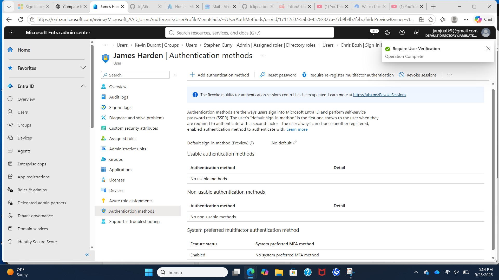

### 3. Tested Number Matching

Microsoft Authenticator displayed a number-matching challenge during sign-in.

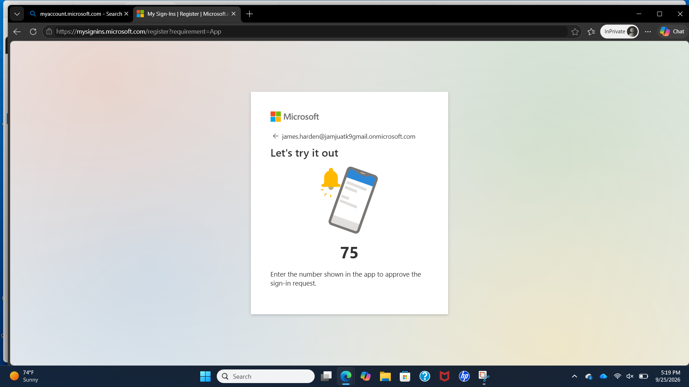

### 4. Verified Microsoft Authenticator

After setup, Microsoft Authenticator appeared as a usable and default authentication method.

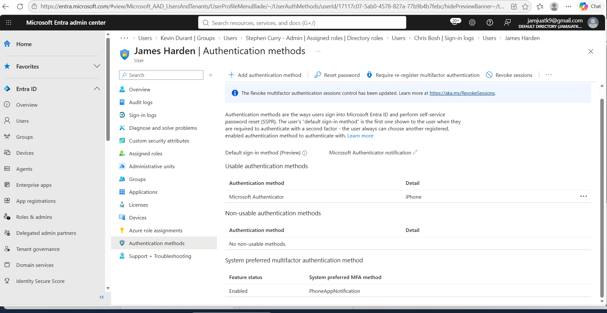

## Result

I found that the user had no usable MFA method, required MFA setup again, registered Microsoft Authenticator, tested number matching, and confirmed the authentication method was working afterward.

## What I Learned

- Multifactor authentication
- MFA troubleshooting
- Microsoft Authenticator
- Number matching
- Authentication methods
- MFA re-registration
- User verification

---

# My Troubleshooting Process

For each ticket, I tried to follow the same basic process:

1. Understand what the user is reporting.
2. Check the user's account and current access.
3. Look at the evidence in Entra.
4. Figure out the actual cause.
5. Make the change needed to fix the problem.
6. Check the account again to make sure the fix worked.

## Skills Demonstrated

- Microsoft Entra ID
- IAM troubleshooting
- Identity lifecycle management
- Joiner-Mover-Leaver processes
- Role-Based Access Control
- Least privilege
- Group membership management
- Administrative role management
- Sign-in log analysis
- Authentication troubleshooting
- Password administration
- Multifactor authentication
- Microsoft Authenticator
- Access validation
- Root-cause analysis
